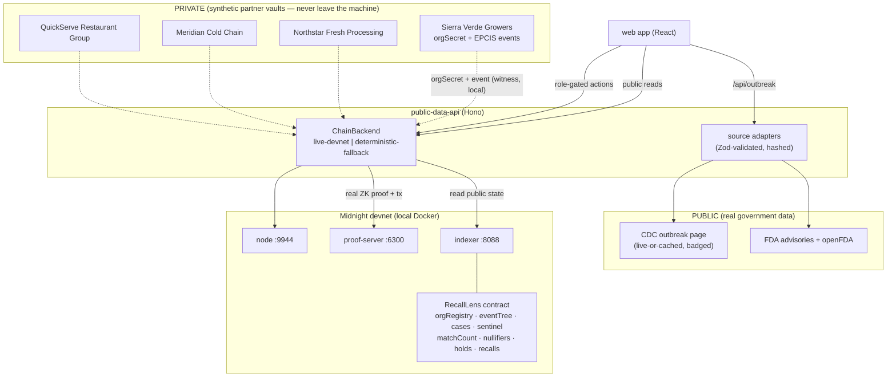

# RecallLens — Architecture

RecallLens is a privacy-preserving food-safety network built on Midnight.
Midnight is the confidential proof and coordination layer: it lets
independently credentialed supply-chain organizations prove that their
private records point at the same hidden supply lineage — without publishing
supplier networks, customer lists, invoices, routes, quantities, or receipts.

## Monorepo layout (npm workspaces)

```
apps/
  web/                 React + Vite + Tailwind app (Command Center, Sentinel,
                       Investigation, Partner Vault, Consumer Check, demo kit)
  public-data-api/     Hono API: real CDC/FDA data, public on-chain reads,
                       role-gated proof submission, workflow orchestration
packages/
  contract/            Compact contract + witnesses + simulator tests
  midnight-client/     Providers, seed wallet, deploy/seed scripts, live +
                       fallback ChainBackend, crypto (circuit-parity hashing)
  gs1/                 GS1 Digital Link parsing, signed Product Passports,
                       in-browser disclosure encryption
  schemas/             Zod schemas: EPCIS domain model, public sources, API
  demo-fixtures/       SYNTHETIC orgs, trace events, signals, case definition
  source-adapters/     CDC/FDA parsers, live-or-cached adapters, snapshots,
                       consumer recall-intelligence engine
e2e/                   Playwright tests (desktop + mobile)
scripts/               health check
docs/                  this documentation set
```

## System diagram



## The trace-proof lifecycle

1. **Register** — a trusted registrar admits each org:
   `registerOrganization(orgCommitment)` where
   `orgCommitment = H("rl:org:v1", orgSecret)`.
2. **Commit** — each org anchors a trace-event commitment:
   `commitTraceEvent(eventCommitment)`. The commitment hides the lineage
   token, product, time, and a blinding factor.
3. **Open case** — the registrar records the public case:
   `openCase(caseId, sourceHash, productHash, windowStart, windowEnd)`.
   `sourceHash` is the sha256 of the checked-in CDC snapshot, so the case is
   bound to a specific official source.
4. **Prove** — each org runs `proveRelevantEvent(caseId)`: a genuine ZK proof
   that one of its committed, registrar-admitted events matches the case
   predicate and time window. It discloses only an anonymous `caseTag` and a
   one-time `orgNullifier`.
5. **Converge** — when 3 distinct credentials prove the same `caseTag`, the
   public `converged` flag flips.
6. **Read** — the indexer exposes the public state; the app renders
   convergence, nullifiers, and counts — never raw records.

## Sentinel (early-warning layer)

Sentinel detects corroborated, privacy-preserving risk convergence *before*
an official advisory. It does not predict or diagnose an outbreak, and the
demo runs as a clearly labeled synthetic pre-outbreak replay.

### Signal categories (demo set)

| Category | Circuit code | Owner (synthetic) | Confidence |
|---|---|---|---|
| PROCESSOR_QA_SIGNAL | 1 | Northstar Fresh Processing | high |
| COLD_CHAIN_SIGNAL | 2 | Meridian Cold Chain | standard |
| EXPOSURE_CLUSTER_SIGNAL | 3 | QuickServe (consumer-aggregate) | standard |

Raw signal evidence (test values, temperatures, complaint details, locations)
stays private — only the derived tag, nullifier, and category counters reach
the ledger.

### Threshold policy (shown transparently in the UI)

At least 3 valid signal proofs, from at least 2 independent credentialed
organizations, across at least 2 categories, with at least 1 high-confidence
(QA) signal, all bound to the same private lineage inside a valid time
window, with duplicates rejected by nullifiers.

The signal nullifier is per **(caseId, orgSecret)** — one signal per org per
case — so 3 accepted signals necessarily come from 3 distinct orgs. Category
diversity is tracked with per-category seen-flags; the threshold flips
in-circuit.

### Sentinel circuits

- `openSentinelCase` — registrar-gated case definition.
- `submitSafetySignal(caseId, category)` — proves in-circuit: org registry
  membership (Merkle), signal-commitment membership (domain separator
  `rl:signal:v1`), category and window bindings, then discloses
  `sentinelTag = H("rl:stag:v1", caseId, lineageToken)` and
  `signalNullifier = H("rl:snull:v1", caseId, orgSecret)` and updates the
  counters and threshold flag.
- `issuePrecautionaryHold(caseId, sentinelTag, holdCommitment)` —
  registrar-gated; requires the threshold. The hold commitment is a set
  commitment over passport commitments (sha256 over the sorted member list,
  computed off-chain).
- `authorizeRecallPredicate(caseId, predicateHash)` — registrar-gated;
  requires an existing hold. The server additionally refuses it before trace
  convergence and a received disclosure package.

### Hold membership (demo design and limitation)

Passport commitments are high-entropy
(`sha256("rl-passport-commit:v1" | gtin | lot | passportId)` with a random
128-bit passportId), so membership cannot be brute-forced from a guessable
lot. The hold-set **commitment** is anchored on-chain; the demo resolver
checks a scanned passport's commitment against the member set service-side.
Production would replace this with a membership proof (Merkle witness or
private set intersection) so the service never learns the queried
commitment. This limitation is stated in the consumer receipt and in
JUDGE_FAQ.md.

## Public / private data boundary

| Data | Where it lives | On the public ledger? |
|---|---|---|
| CDC/FDA outbreak facts | public source adapters | shown in UI, not on-chain |
| Case definition (id, source hash, product predicate, window) | `cases` map | yes (public by design) |
| Org credential | commitment on-chain; secret in vault | only the commitment (opaque) |
| Trace event / safety signal (lineage, lot, qty, route…) | partner vault | only a hiding commitment (opaque) |
| Anonymous lineage tag | derived in-circuit | yes (hash of a random token) |
| Org nullifier | derived in-circuit | yes (hash of the secret) |
| Match counts / convergence / threshold flags | ledger | yes |
| Hold commitment / recall predicate hash | ledger | yes (opaque) |
| Supplier and customer identities, lot codes, quantities, routes, invoices, temperatures | partner vault / fixtures | **never** |
| Consumer identity, receipt, scanned image | device / synthetic fixture | **never** |

See PRIVACY_AUDIT.md for the full `disclose()` inventory and THREAT_MODEL.md
for trust assumptions. Versions and verification evidence: EVIDENCE.md.
