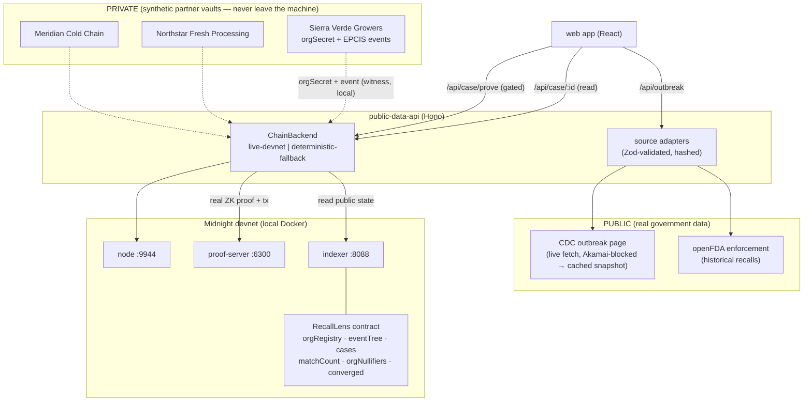

# RecallLens — Architecture

RecallLens is a privacy-preserving food-outbreak detection, traceback,
targeted-recall, and consumer-notification network built on Midnight. Midnight
is used as the **confidential multi-party proof and coordination layer**: it
lets independently-credentialed supply-chain organizations prove that their
private records converge on the same outbreak lineage without publishing their
supplier networks, customer lists, invoices, routes, quantities, or receipts.

## Monorepo layout (npm workspaces)

```
apps/
  web/                 React + Vite + Tailwind browser app (read-only dashboard + investigator + vault + consumer)
  public-data-api/     Hono API: real CDC data, public on-chain reads, gated proof submission
packages/
  contract/            Compact contract + witnesses + simulator tests + compiled artifacts
  midnight-client/     Providers, seed wallet, deploy/prove scripts, live + fallback ChainBackend, crypto (pure-circuit parity)
  schemas/             Zod schemas: EPCIS domain model, public-source data, API contract
  demo-fixtures/       SYNTHETIC orgs, trace events, receipts, recall-impact shipments, case definition
  source-adapters/     CDC HTML parser + live-or-cached adapter, openFDA adapter, checked-in snapshots
e2e/                   Playwright central demo journey (desktop + mobile)
docs/                  This documentation set
```

## System diagram



## The proof lifecycle

1. **Register** — the registrar admits each org: `registerOrganization(orgCommitment)`
   where `orgCommitment = H("rl:org:v1", orgSecret)`. Gated by the registrar
   credential.
2. **Commit** — each org anchors a trace-event commitment:
   `commitTraceEvent(eventCommitment)` where the commitment hides the lineage
   token, product, time, and a blinding factor.
3. **Open case** — the registrar records the public case:
   `openCase(caseId, sourceHash, productHash, windowStart, windowEnd)`.
   `sourceHash` is the sha256 of the checked-in CDC snapshot, binding the case
   to a specific official source.
4. **Prove** — each org runs `proveRelevantEvent(caseId)`: a genuine ZK proof
   that a committed, registrar-admitted event matches the case predicate and
   time window. It discloses only an anonymous `caseTag` and an `orgNullifier`.
5. **Converge** — when `threshold` (3) distinct credentials produce matches for
   the same `caseTag`, the public `converged` flag flips.
6. **Read** — the indexer exposes the public state; the app renders convergence,
   nullifiers, and counts — never raw records.

## Public / private data boundary

| Data | Where it lives | On the public ledger? |
|---|---|---|
| CDC outbreak facts (cases, states, status) | public source adapter | shown in UI, not on-chain |
| Case definition (id, source hash, product predicate, window) | `cases` ledger map | yes (public by design) |
| Org credential | commitment on-chain; secret in vault | only the commitment (opaque) |
| Trace event (lineage, product, time, lot, qty, route…) | partner vault | only a hiding commitment (opaque) |
| Anonymous lineage tag | derived in-circuit | yes (`caseTag`, hash of random token) |
| Org nullifier | derived in-circuit | yes (`orgNullifier`, hash of secret) |
| Match count / convergence | `matchCount`, `converged` | yes |
| Supplier/customer identities, lot codes, quantities, routes, invoices, temperatures | partner vault / fixtures | **never** |
| Consumer identity & receipt | client / synthetic fixture | **never** |

See PRIVACY_AUDIT.md for the exhaustive `disclose()` inventory and THREAT_MODEL.md
for trust assumptions.

## Selected versions (verified this session)

- Compact CLI 0.5.1, compiler 0.31.1, language 0.23
- `@midnight-ntwrk/compact-runtime` 0.16.0
- `@midnight-ntwrk/midnight-js-*` 4.1.1, `@midnight-ntwrk/wallet-sdk` 1.2.0
- Local devnet: node 0.22.5, indexer 4.2.1, proof-server 8.1.0
- Frontend: React 19, Vite 6, Tailwind 3, @xyflow/react 12, Recharts 2, TanStack Query 5
